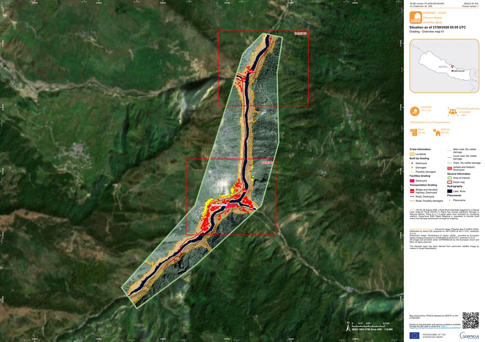
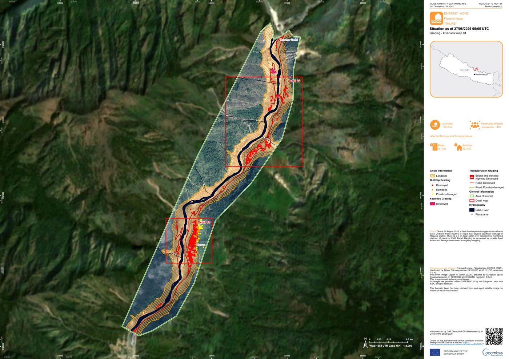
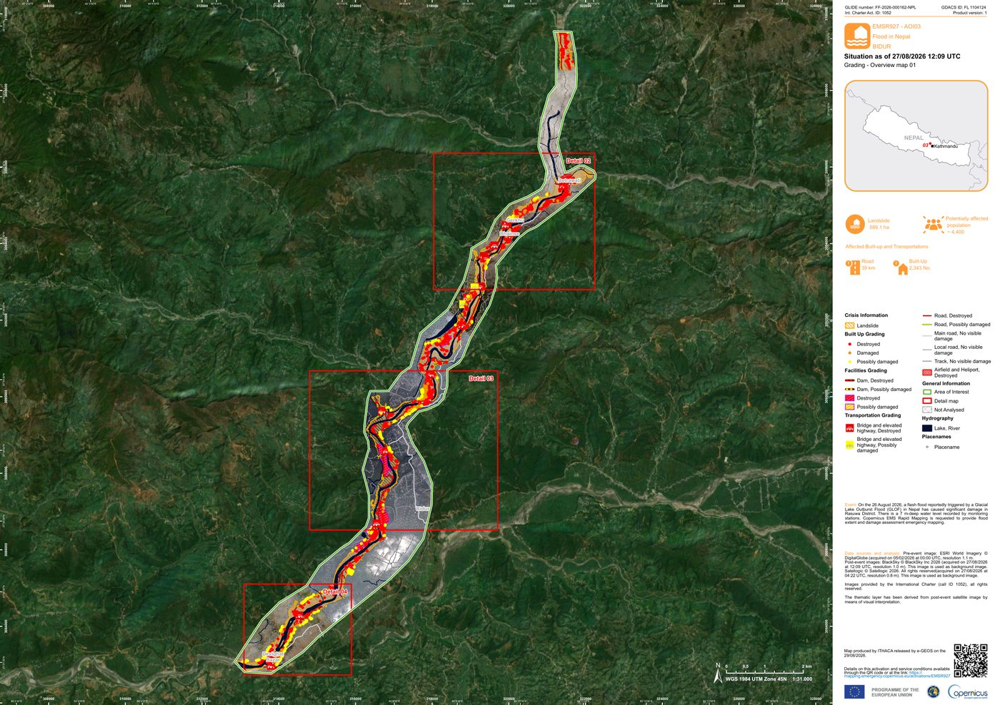

# Nepal — Bhote Koshi, 26 agosto 2026

Análisis del pulso de detritos Rasuwagadhi → Bharatpur (Narayani) tras la avalancha de hielo y roca del 26 de agosto de 2026. (Análisis 29/08/26)

Sitio: https://asoto59g.github.io/Nepal/

Las dos piezas para presentar son HTML estático. No hay servidor ni base de datos.

| Página | Archivo | Qué muestra |
| --- | --- | --- |
| Inicio | [index.html](index.html) | Mapa: mancha HAND Rasuwagadhi–Bharatpur, curvas, EMSR927 al 29 ago 2026 |
| Segunda | [tiempos.html](tiempos.html) | Curva x(t), Manning 1 km y minutos de alerta perdidos |

En cada página hay un enlace a la otra (Mapa / Tiempos de alerta).

---

## index.html — mapa de inundación

Fuente de la página: este HTML (Leaflet 1.9, datos embebidos). No llama a una API propia.

**Qué se ve**

- Núcleo de valle (~17.4 km²) y runup en ladera (~11.0 km²) entre Rasuwagadhi y Bharatpur, **181.4 km** de cauce. **Estimación HAND**, no es la delineación Copernicus. Capa encendible y apagable en el cajetín de capas (arriba a la derecha).
- Barra de escala métrica en la esquina inferior izquierda, pegada al borde.
- Polígonos y edificios de [Copernicus EMSR927](https://mapping.emergency.copernicus.eu/activations/EMSR927/) GRA **al 29 de agosto de 2026**: deslizamientos fotointerpretados en Syapru Besi, Timure y Bidur. Capas apagables en el control de la esquina.
- Mapas GRA oficiales en el panel (AOI01, AOI02 y AOI03). Bharatpur (AOI04) sigue **en espera (W)**: Legion adquirido el 29 ago 04:01 UTC, entrega prevista **17:01 UTC** (mañana por la mañana en Costa Rica / tarde en Nepal). El recuadro azul discontinuo en el mapa es el AOI, sin polígonos GRA.
- Eje del río, comunidades con hora de llegada (NPT) y minutos de alerta perdidos, hasta Bharatpur.
- **Devighat HEP (Nuwakot, km 58, 09:39)** no es **Devghat (Chitwan, km 178, 15:20 DHM)**. El modelo de dos tramos llega a Bharatpur a las **15:33**.
- Curvas de nivel (10 m en garganta, 20 m bajo 400 m), capa encendible y apagable. Clic en una curva muestra la cota.

**Copernicus EMSR927 (corte 29 ago 2026)**

Ya hay vector público GRA para las tres AOI del corredor alto y medio. El evento CEMS es `6-Mass Movement` / landslide, no una mancha de llanura. Total **829 ha**.

| AOI | Localidad | Estado al 29 ago | Producto | Área deslizamiento | Edificios (dest. / dañ. / pos. dañ.) |
| --- | --- | --- | --- | --- | --- |
| 01 | Syapru Besi | Publicado (F) | GRA v1, WorldView-3 27 ago 05:05 UTC | **111 ha** | 323 / 32 / 78 |
| 02 | Timure | Publicado (F) | GRA v2, Legion 27 ago 05:05 UTC | **129 ha** | 372 / 33 / 26 |
| 03 | Bidur | Publicado (F) | GRA v1, BlackSky 12:09 UTC / Satellogic 04:22 UTC (27 ago) | **589 ha** | 1826 / 220 / 297 |
| 04 | Bharatpur | En espera (W) | Legion 29 ago 04:01 UTC (entrega prevista 17:01 UTC) | — | — |

En el repo: `emsr927_hasta_hoy.geojson` y JPEG en `media/`.

**Cómo se construyó la mancha HAND**

La mancha naranja/roja es un HAND aproximado sobre NASA HMA 8 m (`HMA_DEM8m_MOS_20170716_tile-675`, Shean 2017, cotas elipsoidales WGS84) y Copernicus GLO-30 (N27E084) en el borde oeste del mosaico (~84.45°E), con offset vertical −49 m al datum HMA. No sustituye a EMSR927. El tile HMA cubre casi todo el corredor; Bharatpur ciudad queda ~2 km al oeste del borde.

| Tramo | Núcleo (H / ancho) | Runup (H / ancho) |
| --- | --- | --- |
| Garganta km 0–20 | 12 m / 280 m | 40 m / 450 m |
| Medio km 20–40 | 10 m / 450 m | 30 m / 700 m |
| Devighat km 40–60 | 9 m / 700 m | 22 m / 1100 m |
| Trishuli medio km 60–100 | 7 m / 900 m | 16 m / 1500 m |
| Narayani km >100 | 5 m / 1500 m | 10 m / 2800 m |

Áreas resultantes: núcleo **17.4 km²**, runup **11.0 km²** (el tramo bajo es valle abierto; no es comparable 1:1 con las 3.2 + 5.1 km² de solo la garganta).

Curvas: 10 m en garganta, 20 m bajo 400 m, recortadas a ~1.2 km del cauce.

Sentinel-1 (par 16 vs 28 ago, misma órbita) y Sentinel-2 (24 vs 27 ago, 54–78 % nubes) **no** delinean el corredor alto: el cambio S1 fiable es ~3 ha frente a la mancha HAND.

**Scripts que regeneran esta página**

1. `calcular_manning.py` → `resultado_manning.json` / `curva_1km.csv` (cauce OSM por hitos)
2. `generar_mapa_inundacion.py` → `inundacion_bhote_koshi.geojson`
3. `generar_curvas_10m.py` → `curvas_10m_hma.geojson`
4. `preparar_emsr927.py` → `emsr927_hasta_hoy.geojson` + JPEG en `media/`
5. `escribir_mapa_html.py` → `index.html`
6. `escribir_tiempos_html.py` → `tiempos.html`

El GeoTIFF HMA (~348 MB) y el COP30 N27E084 no van en el repositorio. Los zips GRA de CEMS tampoco.

---

## tiempos.html — minutos de alerta perdidos

Fuente de la página: este HTML (tablas y SVG; sin Leaflet). Cifras tomadas de `resultado_manning.json` / `curva_1km.csv`.

**Reloj (NPT)**

- 08:37 sismo / avalancha (USGS).
- 08:38 alerta automática hipotética (90 s después).
- 08:50 Syabrubesi deja de transmitir (ancla del modelo).
- 09:16 SMS masivo DHM.
- 09:20 Betrawati deja de transmitir (segunda ancla).

- 09:39 Devighat HEP (Nuwakot), modelo (fin de la garganta).
- 15:20 Devghat (Chitwan): frente DHM (ancla del tramo bajo).
- 15:33 Bharatpur (Narayani), modelo.

**Manning**

`V = (1/n) · R^(2/3) · S^(1/2)`, `n = 0.040`. **R1 = 10.05 m** calibrado para Syabrubesi → Betrawati = 30 min. **R2 = 18.95 m** aguas abajo de Devighat HEP para que Devghat coincida con DHM ~15:20 (con R1 solo el modelo llegaba ~18:19: el valle es más tendido). Eje OSM forzado por hitos (si no, el camino más corto se sale de la garganta). DEM: HMA 8 m + COP30 N27E084. Longitud **181.4 km**, desnivel 1638 m.

A las 09:16 el frente está ~km 42. Aguas abajo de ~km 42 los minutos perdidos son constantes: **38 min** (09:16 − 08:38).

| Lugar | km | Llegada | SMS 09:16 | Auto 08:38 | Perdidos |
| --- | --- | --- | --- | --- | --- |
| Rasuwagadhi | 0 | 08:36 | 0 | 0 | 0 |
| Timure | 3 | 08:38 | 0 | 0 | 0 |
| Syabrubesi | 15 | 08:50 | 0 | 12 | 12 |
| Mailung | 32 | 09:06 | 0 | 29 | 29 |
| Betrawati | 45 | 09:20 | 4 | 42 | **38** |
| Trishuli HEP | 53 | 09:31 | 15 | 53 | **38** |
| Devighat HEP | 58 | 09:39 | 24 | 62 | **38** |
| Galchhi | 79 | 10:15 | 60 | 98 | **38** |
| Malekhu | 105 | 11:25 | 129 | 167 | **38** |
| Muglin | 144 | 13:21 | 246 | 284 | **38** |
| Devghat (Chitwan) | 178 | 15:20 | 364 | 402 | **38** |
| Bharatpur | 181.4 | 15:33 | 377 | 415 | **38** |

Rasuwagadhi 08:36 queda ~1 min antes del sismo 08:37: el tramo alto es muy pendiente y el reloj está anclado en Syabrubesi 08:50. Manning de agua clara es de primer orden; el evento fue un flujo de detritos.

**Scripts:** `calcular_manning.py` (cauce: `fetch_rios.py` / `rios_overpass.json`) y `escribir_tiempos_html.py`.

---

## Aviso cuando EMSR927 publique algo nuevo

Un workflow de GitHub Actions (`Vigilar EMSR927`) consulta la API de Copernicus cada 2 h. Si Bharatpur u otra AOI cambia de estado, sube de versión o aparece el zip GRA:

1. Abre un [issue](https://github.com/asoto59g/Nepal/issues) con etiqueta `emsr927` y te lo asigna (notificación GitHub; el correo de GitHub llega si tienes Issues activado en [notification settings](https://github.com/settings/notifications)).
2. Envía un correo a `oasotob@yahoo.com`.

El mapa no se actualiza solo. Tras el aviso: bajar el zip GRA, `python preparar_emsr927.py` y `python escribir_mapa_html.py`.

**Correo SMTP (obligatorio para el punto 2).** En el repo: Settings → Secrets and variables → Actions, crear:

| Secreto | Valor |
| --- | --- |
| `SMTP_PASSWORD` | Contraseña de aplicación de Yahoo (no la clave normal). [Generarla](https://login.yahoo.com/account/security) con verificación en dos pasos. |

Opcionales si no usas Yahoo: `SMTP_SERVER`, `SMTP_PORT`, `SMTP_USER`, `MAIL_TO`, `MAIL_FROM`.

También se puede lanzar a mano: Actions → Vigilar EMSR927 → Run workflow.

---

